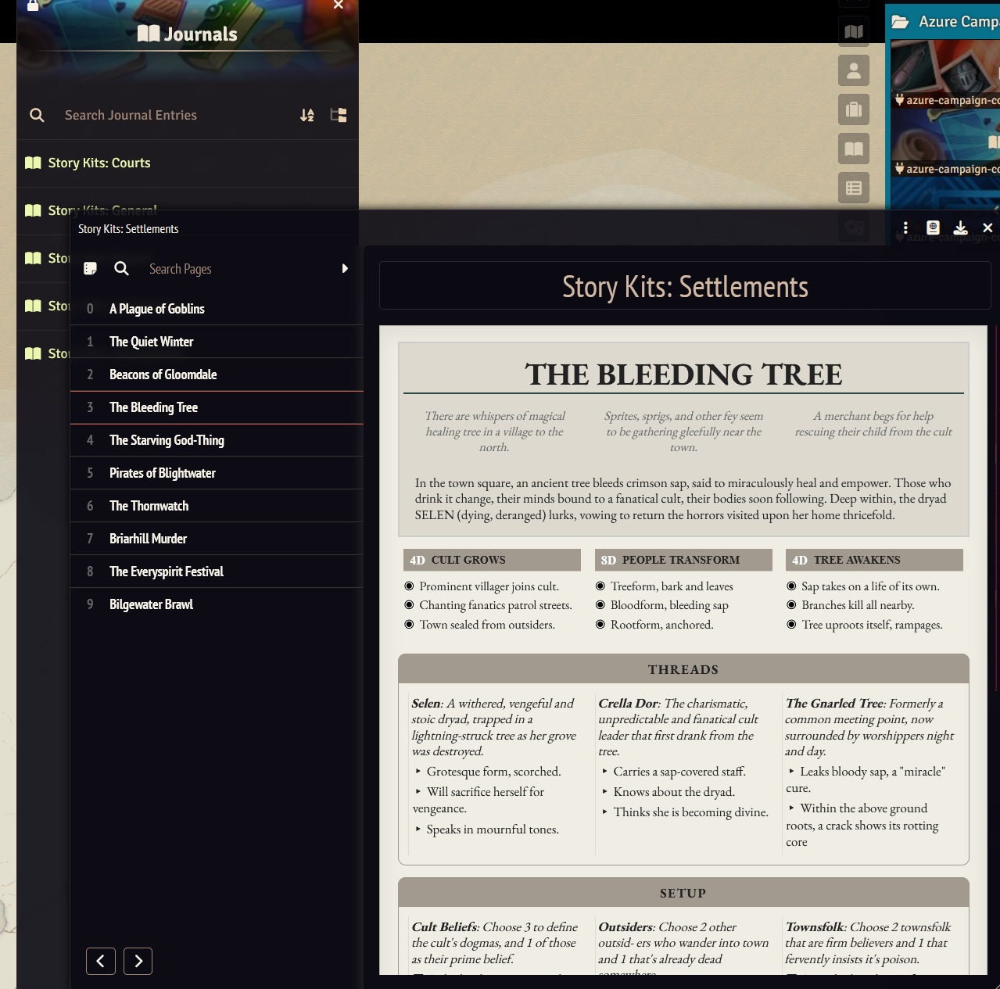

# Azure's Campaign Compendia

A Foundry VTT system-agnostic module with compendia that includes a toolkit for GMs to help run campaigns.

`https://github.com/Azurelol/azure-campaign-compendia/releases/latest/download/module.json`

## Features

### Story Kits
A collection of one-page modular inspirations for running adventures in a location or beyond. The concept for this
and most of the current entries was sourced from the excellent [Grimwild](https://www.drivethrurpg.com/en/product/507201/grimwild-free-edition) system.

## Installation

1. Open the Foundry Setup screen and navigate to the "Add-on Modules" tab.
2. Click the "Install Module" button on the bottom left.
3. Paste the `Manifest URL` above.
4. Click "Install".
5. Launch the game world and go to `Game Settings > Manage Modules` and enable the module.

## Usage

Once installed, you can find the compendiums in your Compendiums tab. 

## Credits

If any assets are provided, I will try my best to keep an `ATTRIBUTION.MD` file on the same folder as the asset to attribute the creator directly. I have taken care to use assets under the creative commons (CC) license.
